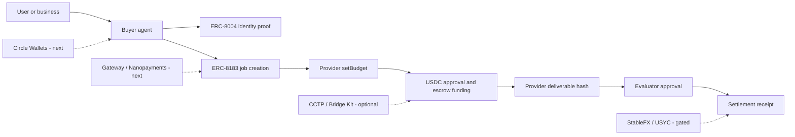

# Arc Agentic Commerce Settlement

Stablecoin commerce stack MVP on Arc for the **Agentic Economy** track of **The Stablecoins Commerce Stack Challenge**.

The project models a buyer agent purchasing a report, dataset, API result, or service with USDC on Arc. It verifies agent identity, creates a budgeted settlement job, prepares wallet-submitted Arc Testnet transactions, records deliverable evidence, and exports a deterministic settlement receipt.

```text
buyer agent -> ERC-8004 identity -> ERC-8183 job -> provider budget -> USDC escrow -> deliverable proof -> evaluator approval -> settlement receipt
```

## For Challenge Judges

**Verdict: READY WITH CHANGES**

| Resource | URL |
| --- | --- |
| Live demo | https://arc-agentic-settlement-lab.vercel.app |
| Challenge pack | https://arc-agentic-settlement-lab.vercel.app/challenge |
| Job console | https://arc-agentic-settlement-lab.vercel.app/jobs |
| Agent identity | https://arc-agentic-settlement-lab.vercel.app/identity |
| API blueprint | https://arc-agentic-settlement-lab.vercel.app/api/arc-settlement |
| Arcscan | https://testnet.arcscan.app |

**Track:** Best Agentic Economy Experience on Arc

**What is live and verifiable:**
- USDC on Arc — settlement asset and gas rail throughout the lifecycle.
- ERC-8004 agent identity reads — `ownerOf` and `tokenURI` from Arc Testnet IdentityRegistry (`0x8004A818BFB912233c491871b3d84c89A494BD9e`).
- ERC-8183 AgenticCommerce lifecycle — calldata preparation for all six actions (`createJob`, `setBudget`, `approve`, `fund`, `submit`, `complete`) and wallet tx submission via the deployed contract (`0x0747EEf0706327138c69792bF28Cd525089e4583`).
- Deterministic receipt export — JSON and Markdown with SHA-256 receipt hash and deliverable hash binding.

**What is not claimed as live:**
- Circle Wallets, Gateway / Nanopayments, CCTP / Bridge Kit, USYC, StableFX.

**Remaining gates before final submission:**
1. Complete one end-to-end wallet-signed Arc Testnet run and record tx hashes.
2. Record a short demo video (job console, identity read, receipt export).

## Live Links

- Demo: https://arc-agentic-settlement-lab.vercel.app
- Challenge pack: https://arc-agentic-settlement-lab.vercel.app/challenge
- Arcscan: https://testnet.arcscan.app
- Arc docs: https://docs.arc.network

## Challenge Fit

| Requirement | Project status |
| --- | --- |
| Track | Best Agentic Economy Experience on Arc |
| Functional frontend | Implemented: overview, identity verifier, job console, challenge pack |
| Backend APIs | Implemented: blueprint, job lifecycle, receipt generation, identity reads, ERC-8183 tx preparation |
| Architecture diagram | Included in `/challenge` and `docs/CHALLENGE_SUBMISSION_PACK.md` |
| GitHub setup docs | Included |
| Demo URL | Vercel production deployment |
| Circle Product Feedback | Included in `/challenge` and `docs/CIRCLE_PRODUCT_FEEDBACK.md` |
| Video demo | Pending final live wallet run and recording |

## What Is Implemented

- **USDC on Arc**: the settlement asset and gas-denominated rail used by the MVP.
- **ERC-8004 identity proof**: prepare `register(string metadataURI)` calldata and verify existing identities by reading `ownerOf(agentId)` and `tokenURI(agentId)` from Arc Testnet.
- **ERC-8183 AgenticCommerce lifecycle**: prepare wallet-submitted calls for `createJob`, `setBudget`, `approve`, `fund`, `submit`, and `complete`.
- **Budgeted service workflow**: buyer-agent service request, provider budget, escrow funding, deliverable proof, evaluator approval.
- **Receipt export**: JSON and Markdown receipts with receipt hash, deliverable hash, tx hash slots, agent identity, lifecycle status, and settlement mode.
- **Challenge-facing documentation**: submission pack, architecture, Circle Product Feedback, implementation boundaries.

## Current Boundaries

The project is intentionally explicit about what is live and what is not.

- Live / implemented:
  - Arc Testnet reads for ERC-8004 identity.
  - Wallet transaction preparation for ERC-8183.
  - Job lifecycle API and UI.
  - Deterministic receipt generation.
- Not claimed as live yet:
  - Circle Wallets server-driven wallet flow.
  - Circle Gateway / Nanopayments buyer-seller setup.
  - CCTP / Bridge Kit funding.
  - USYC or StableFX execution.
  - Production database, secrets handling, or compliance workflow.

The strongest next gate is a real end-to-end Arc Testnet run with tx hashes for the full ERC-8183 sequence.

## Architecture



## Product Pages

- `/` - challenge-oriented overview and stablecoin commerce stack positioning.
- `/jobs` - agentic commerce console for creating and advancing settlement jobs.
- `/identity` - ERC-8004 identity preparation and verifier.
- `/challenge` - submission pack, architecture, product matrix, checklist, and Circle Product Feedback.

## API Surface

| Method | Path | Description |
| --- | --- | --- |
| `GET` | `/api/arc-settlement` | Blueprint: contracts, capabilities, lifecycle, receipt schema |
| `GET` | `/api/arc-identity` | ERC-8004 identity verifier context |
| `POST` | `/api/arc-identity/prepare` | Prepare IdentityRegistry `register(string)` calldata |
| `POST` | `/api/arc-identity/verify` | Verify `ownerOf` and `tokenURI` for an existing agent ID |
| `GET` | `/api/arc-commerce` | ERC-8183 AgenticCommerce execution context |
| `POST` | `/api/arc-commerce/prepare` | Prepare wallet transaction calldata for ERC-8183 actions |
| `GET` | `/api/arc-commerce/jobs/:id` | Read ERC-8183 `getJob(jobId)` from Arc Testnet |
| `GET` | `/api/arc-commerce/tx/:hash` | Inspect an Arc Testnet transaction receipt and parse `JobCreated` |
| `GET` | `/api/arc-settlement/jobs` | List jobs |
| `POST` | `/api/arc-settlement/jobs` | Create a job |
| `GET` | `/api/arc-settlement/jobs/:id` | Get a job |
| `PATCH` | `/api/arc-settlement/jobs/:id` | Update job status, budget, tx evidence, identity, or deliverable hash |
| `GET` | `/api/arc-settlement/jobs/:id/receipt` | Generate deterministic receipt |

## Local Setup

```bash
npm install
npm run dev
```

Open `http://localhost:3000`.

## Verification

```bash
npm run lint
npm run build
```

Production smoke test:

```bash
node - <<'NODE'
const base = "https://arc-agentic-settlement-lab.vercel.app";
for (const path of ["/", "/jobs", "/identity", "/challenge", "/api/arc-commerce", "/api/arc-identity", "/api/arc-settlement"]) {
  const res = await fetch(base + path);
  console.log(res.status, path);
}
NODE
```

## Challenge Submission Notes

Recommended track:

```text
Best Agentic Economy Experience on Arc
```

Recommended short description:

```text
An agentic commerce settlement MVP on Arc where buyer agents purchase services with USDC, verify agent identity, enforce provider budgets, escrow settlement, bind deliverable proof, and export auditable receipts.
```

Recommended products to claim as live:

- USDC
- Arc Testnet
- ERC-8004
- ERC-8183

Recommended products to discuss as next integrations:

- Circle Wallets
- Gateway / Nanopayments
- CCTP / Bridge Kit

Recommended products to treat as gated or conceptual unless access is granted:

- USYC
- StableFX

## Documents

- [Challenge submission pack](docs/CHALLENGE_SUBMISSION_PACK.md)
- [Circle Product Feedback](docs/CIRCLE_PRODUCT_FEEDBACK.md)
- [Arc Agentic Settlement Lab plan](docs/ARC_AGENTIC_SETTLEMENT_LAB_PLAN.md)
- [Arc official context for engineering](docs/ARC_OFFICIAL_CONTEXT_FOR_ENGINEERING.md)
- [Arc Discord and X research notes](docs/ARC_DISCORD_X_RESEARCH_NOTES.md)
- [Copilot Arc strategy review](docs/COPILOT_ARC_STRATEGY_REVIEW.md)
- [Engineering handoff](docs/ENGINEERING_HANDOFF.md)

## Public Repo Hygiene

- Do not commit API keys, entity secrets, private keys, mnemonics, local logs, or browser session data.
- Do not claim onchain completion without transaction hashes.
- Do not claim Circle Wallets, Gateway, CCTP, USYC, or StableFX execution unless a working integration is present.
- Settlement can remain simulated, onchain-partial, or onchain-verified. Only mark `onchain-verified` after every relevant tx hash is recorded.
- Not financial advice. Not a production financial system.
