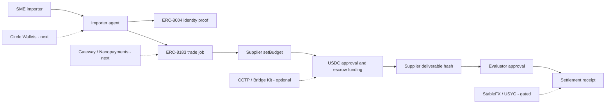

# ArcEscrow - Agentic Letter of Credit (ALC) for Cross-Border SME Trade

**ArcEscrow** is a decentralized, programmatic escrow platform built on Circle's Arc Settlement Protocol. It replaces slow and costly traditional bank Letters of Credit (L/C) with programmatically settled USDC escrows, gated by verifiable **ERC-8004 AI logistics-audit agents** and **ERC-8183 settlement lifecycles**.

```text
[Buyer/Party A] ➔ Create Escrow (USDC) ➔ [Supplier/Party B] ➔ Upload Delivery Proof ➔ [AI Evaluator/Party C] ➔ Verify & Release ➔ Settled Receipt
```

## Live Links

- **App**: https://arc-agentic-settlement-lab.vercel.app
- **Deal Room Console**: https://arc-agentic-settlement-lab.vercel.app/jobs
- **Agent Proof Directory**: https://arc-agentic-settlement-lab.vercel.app/identity
- **Arcscan**: https://testnet.arcscan.app
- **Arc Docs**: https://docs.arc.network

---

## The Real-World Landing Scenario

### The Problem: The SME Cross-Border Trade trust gap
In global commerce, small-and-medium enterprises (SMEs) face a fundamental trust gap:
- **Party A (Buyer / Importer)** is hesitant to pay upfront, fearing shipping delays or sub-standard cargo.
- **Party B (Supplier / Exporter)** is hesitant to ship cargo before securing payment, fearing default.
- **Traditional Solution**: Bank **Letters of Credit (L/C)**. However, they are slow (taking weeks of paperwork), expensive (2-5% fee), and inaccessible for smaller enterprises.

### Our Solution: Programmatic Escrow Gated by AI Audits
**ArcEscrow** bridges this trust gap using Circle's USDC and decentralized evaluation:
1. **Buyer (Party A)** locks USDC into the Arc Escrow contract, specifying the release conditions (e.g., invoice details, target cargo hash, and selected logistics auditor).
2. **Supplier (Party B)** prepares the shipment and submits digital delivery evidence (e.g. carrier receipt hash) to the deal room.
3. **AI Evaluator (Party C)**—an independent registered agent—validates the logistics documents on-chain and releases the locked USDC.
4. **Instant Compliance**: CFOs export a tamper-proof cryptographic receipt containing logistics metadata, agent approvals, and transaction logs, directly suitable for financial audit.

---

## What Is Implemented

- **USDC on Arc**: the settlement asset and gas-denominated rail used by the MVP.
- **ERC-8004 identity proof**: prepare `register(string metadataURI)` calldata and verify existing identities by reading `ownerOf(agentId)` and `tokenURI(agentId)` from Arc Testnet.
- **ERC-8183 AgenticCommerce lifecycle**: prepare wallet-submitted calls for `createJob`, `setBudget`, `approve`, `fund`, `submit`, and `complete`; the UI only advances settlement state from Arc transaction evidence.
- **Proof-gated deal room**: buyer request, supplier budget, escrow funding, deliverable proof, evaluator approval.
- **Receipt export**: JSON and Markdown receipts with invoice/trade context, receipt hash, deliverable hash, tx hash slots, agent identity, lifecycle status, and settlement mode. Receipt generation is disabled until Arc transaction evidence exists.
- **Implementation documentation**: architecture notes, Arc official context, Circle product feedback, implementation boundaries.

## Current Boundaries

The project is intentionally explicit about what is live and what is not.

- Live / implemented:
  - Arc Testnet reads for ERC-8004 identity.
  - Wallet transaction preparation for ERC-8183.
  - Job lifecycle API and UI.
  - Deterministic receipt generation.
- Not claimed as live yet:
  - Circle Wallets server-driven wallet flow.
  - Circle Gateway / Nanopayments buyer-seller setup.
  - CCTP / Bridge Kit funding.
  - USYC or StableFX execution.
  - Production database, secrets handling, or compliance workflow.

The strongest next gate is a real end-to-end Arc Testnet run with tx hashes for the full ERC-8183 sequence.

## Architecture



## Product Pages

- `/` - product overview for proof-gated USDC escrow on Arc.
- `/jobs` - deal room for creating and advancing escrow-backed settlement deals.
- `/identity` - optional ERC-8004 agent proof preparation and verifier.
- `/challenge` - hidden submission pack for external review contexts; not part of the user flow.

## API Surface

| Method | Path | Description |
| --- | --- | --- |
| `GET` | `/api/arc-settlement` | Blueprint: contracts, capabilities, lifecycle, receipt schema |
| `GET` | `/api/arc-identity` | ERC-8004 identity verifier context |
| `POST` | `/api/arc-identity/prepare` | Prepare IdentityRegistry `register(string)` calldata |
| `POST` | `/api/arc-identity/verify` | Verify `ownerOf` and `tokenURI` for an existing agent ID |
| `GET` | `/api/arc-commerce` | ERC-8183 AgenticCommerce execution context |
| `POST` | `/api/arc-commerce/prepare` | Prepare wallet transaction calldata for ERC-8183 actions |
| `GET` | `/api/arc-commerce/jobs/:id` | Read ERC-8183 `getJob(jobId)` from Arc Testnet |
| `GET` | `/api/arc-commerce/tx/:hash` | Inspect an Arc Testnet transaction receipt and parse `JobCreated` |
| `GET` | `/api/arc-settlement/jobs` | List jobs |
| `POST` | `/api/arc-settlement/jobs` | Create a job |
| `GET` | `/api/arc-settlement/jobs/:id` | Get a job |
| `PATCH` | `/api/arc-settlement/jobs/:id` | Update job status, budget, tx evidence, identity, or deliverable hash |
| `GET` | `/api/arc-settlement/jobs/:id/receipt` | Generate deterministic receipt |

## Local Setup

```bash
npm install
npm run dev
```

Open `http://localhost:3000`.

## Verification

```bash
npm run lint
npm run build
```

Production smoke test:

```bash
node - <<'NODE'
const base = "https://arc-agentic-settlement-lab.vercel.app";
for (const path of ["/", "/jobs", "/identity", "/challenge", "/api/arc-commerce", "/api/arc-identity", "/api/arc-settlement"]) {
  const res = await fetch(base + path);
  console.log(res.status, path);
}
NODE
```

## External Review Notes

Recommended track:

```text
Best Agentic Economy Experience on Arc
```

Recommended short description:

```text
An Arc escrow deal room where USDC payments wait for delivery proof, evaluator approval, and auditable receipt evidence instead of behaving like blind wallet transfers.
```

Recommended products to claim as live:

- USDC
- Arc Testnet
- ERC-8004
- ERC-8183

Recommended products to discuss as next integrations:

- Circle Wallets
- Gateway / Nanopayments
- CCTP / Bridge Kit

Recommended products to treat as gated or conceptual unless access is granted:

- USYC
- StableFX

## Documents

- [Challenge submission pack](docs/CHALLENGE_SUBMISSION_PACK.md)
- [Submission readiness](docs/SUBMISSION_READINESS.md)
- [Circle Product Feedback](docs/CIRCLE_PRODUCT_FEEDBACK.md)
- [Arc Agentic Settlement Lab plan](docs/ARC_AGENTIC_SETTLEMENT_LAB_PLAN.md)
- [Arc official context for engineering](docs/ARC_OFFICIAL_CONTEXT_FOR_ENGINEERING.md)
- [Arc Discord and X research notes](docs/ARC_DISCORD_X_RESEARCH_NOTES.md)

## Public Repo Hygiene

- Do not commit API keys, entity secrets, private keys, mnemonics, local logs, or browser session data.
- Do not claim onchain completion without transaction hashes.
- Do not claim Circle Wallets, Gateway, CCTP, USYC, or StableFX execution unless a working integration is present.
- A draft settlement is only a local deal record. Do not treat it as settled until Arc transaction hashes are recorded.
- Only mark `onchain-verified` after every relevant ERC-8183 tx hash is recorded.
- Not financial advice. Not a production financial system.
