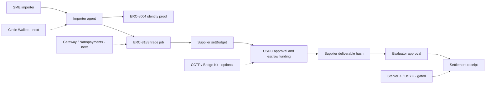

# Arc Trade Agent Settlement

Arc Trade Agent Settlement is a testnet product for SME cross-border trade settlement on Arc.

The app models an importer agent settling an invoice or trade document package with a supplier agent using USDC. It verifies agent identity, captures invoice and country-route context, creates a budgeted ERC-8183 job, prepares wallet-submitted Arc Testnet transactions, records deliverable evidence, and exports a deterministic trade settlement receipt.

```text
importer agent -> ERC-8004 identity -> ERC-8183 trade job -> supplier budget -> USDC escrow -> trade proof -> evaluator approval -> settlement receipt
```

## Live Links

- Demo: https://arc-agentic-settlement-lab.vercel.app
- Trade console: https://arc-agentic-settlement-lab.vercel.app/jobs
- Agent identity: https://arc-agentic-settlement-lab.vercel.app/identity
- Arcscan: https://testnet.arcscan.app
- Arc docs: https://docs.arc.network

## What Problem It Solves

Normal stablecoin transfers prove that tokens moved. They usually do not prove why the payment happened, which agent acted, which invoice or trade route was involved, what budget was approved, whether the supplier submitted deliverable proof, or how the receipt can be audited later.

This product wraps a payment in a trade workflow:

| Stage | User meaning |
| --- | --- |
| Trade context | Invoice ID, buyer country, supplier country, goods/service, and compliance status are recorded. |
| Agent identity | The importer or supplier can be tied to an ERC-8004 identity instead of only an address. |
| Budget | The supplier states the expected USDC amount before funding. |
| Escrow | Funds are prepared for the ERC-8183 job lifecycle rather than sent as a blind transfer. |
| Deliverable | The supplier records proof of completed trade documents or service output. |
| Receipt | The final output binds trade context, identity, amount, deliverable hash, tx slots, and lifecycle status. |

## What Is Implemented

- **USDC on Arc**: the settlement asset and gas-denominated rail used by the MVP.
- **ERC-8004 identity proof**: prepare `register(string metadataURI)` calldata and verify existing identities by reading `ownerOf(agentId)` and `tokenURI(agentId)` from Arc Testnet.
- **ERC-8183 AgenticCommerce lifecycle**: prepare wallet-submitted calls for `createJob`, `setBudget`, `approve`, `fund`, `submit`, and `complete`.
- **Budgeted trade workflow**: importer-agent request, supplier budget, escrow funding, deliverable proof, evaluator approval.
- **Receipt export**: JSON and Markdown receipts with invoice/trade context, receipt hash, deliverable hash, tx hash slots, agent identity, lifecycle status, and settlement mode.
- **Implementation documentation**: architecture notes, Arc official context, Circle product feedback, implementation boundaries.

## Current Boundaries

The project is intentionally explicit about what is live and what is not.

- Live / implemented:
  - Arc Testnet reads for ERC-8004 identity.
  - Wallet transaction preparation for ERC-8183.
  - Job lifecycle API and UI.
  - Deterministic receipt generation.
- Not claimed as live yet:
  - Circle Wallets server-driven wallet flow.
  - Circle Gateway / Nanopayments buyer-seller setup.
  - CCTP / Bridge Kit funding.
  - USYC or StableFX execution.
  - Production database, secrets handling, or compliance workflow.

The strongest next gate is a real end-to-end Arc Testnet run with tx hashes for the full ERC-8183 sequence.

## Architecture



## Product Pages

- `/` - product overview for SME cross-border trade settlement on Arc.
- `/jobs` - trade settlement console for creating and advancing invoice-backed settlement jobs.
- `/identity` - ERC-8004 identity preparation and verifier.
- `/challenge` - hidden submission pack for external review contexts; not part of the user flow.

## API Surface

| Method | Path | Description |
| --- | --- | --- |
| `GET` | `/api/arc-settlement` | Blueprint: contracts, capabilities, lifecycle, receipt schema |
| `GET` | `/api/arc-identity` | ERC-8004 identity verifier context |
| `POST` | `/api/arc-identity/prepare` | Prepare IdentityRegistry `register(string)` calldata |
| `POST` | `/api/arc-identity/verify` | Verify `ownerOf` and `tokenURI` for an existing agent ID |
| `GET` | `/api/arc-commerce` | ERC-8183 AgenticCommerce execution context |
| `POST` | `/api/arc-commerce/prepare` | Prepare wallet transaction calldata for ERC-8183 actions |
| `GET` | `/api/arc-commerce/jobs/:id` | Read ERC-8183 `getJob(jobId)` from Arc Testnet |
| `GET` | `/api/arc-commerce/tx/:hash` | Inspect an Arc Testnet transaction receipt and parse `JobCreated` |
| `GET` | `/api/arc-settlement/jobs` | List jobs |
| `POST` | `/api/arc-settlement/jobs` | Create a job |
| `GET` | `/api/arc-settlement/jobs/:id` | Get a job |
| `PATCH` | `/api/arc-settlement/jobs/:id` | Update job status, budget, tx evidence, identity, or deliverable hash |
| `GET` | `/api/arc-settlement/jobs/:id/receipt` | Generate deterministic receipt |

## Local Setup

```bash
npm install
npm run dev
```

Open `http://localhost:3000`.

## Verification

```bash
npm run lint
npm run build
```

Production smoke test:

```bash
node - <<'NODE'
const base = "https://arc-agentic-settlement-lab.vercel.app";
for (const path of ["/", "/jobs", "/identity", "/challenge", "/api/arc-commerce", "/api/arc-identity", "/api/arc-settlement"]) {
  const res = await fetch(base + path);
  console.log(res.status, path);
}
NODE
```

## External Review Notes

Recommended track:

```text
Best Agentic Economy Experience on Arc
```

Recommended short description:

```text
An SME trade settlement product on Arc where importer agents settle cross-border invoices with USDC, verify agent identity, enforce supplier budgets, escrow settlement, bind deliverable proof, and export auditable receipts.
```

Recommended products to claim as live:

- USDC
- Arc Testnet
- ERC-8004
- ERC-8183

Recommended products to discuss as next integrations:

- Circle Wallets
- Gateway / Nanopayments
- CCTP / Bridge Kit

Recommended products to treat as gated or conceptual unless access is granted:

- USYC
- StableFX

## Documents

- [Challenge submission pack](docs/CHALLENGE_SUBMISSION_PACK.md)
- [Submission readiness](docs/SUBMISSION_READINESS.md)
- [Circle Product Feedback](docs/CIRCLE_PRODUCT_FEEDBACK.md)
- [Arc Agentic Settlement Lab plan](docs/ARC_AGENTIC_SETTLEMENT_LAB_PLAN.md)
- [Arc official context for engineering](docs/ARC_OFFICIAL_CONTEXT_FOR_ENGINEERING.md)
- [Arc Discord and X research notes](docs/ARC_DISCORD_X_RESEARCH_NOTES.md)
- [Copilot Arc strategy review](docs/COPILOT_ARC_STRATEGY_REVIEW.md)
- [Engineering handoff](docs/ENGINEERING_HANDOFF.md)

## Public Repo Hygiene

- Do not commit API keys, entity secrets, private keys, mnemonics, local logs, or browser session data.
- Do not claim onchain completion without transaction hashes.
- Do not claim Circle Wallets, Gateway, CCTP, USYC, or StableFX execution unless a working integration is present.
- Settlement can remain simulated, onchain-partial, or onchain-verified. Only mark `onchain-verified` after every relevant tx hash is recorded.
- Not financial advice. Not a production financial system.
