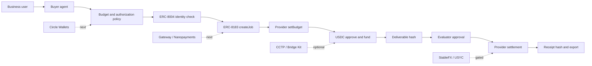

# Challenge Submission Pack

## Review Verdict

**READY WITH CHANGES**

### Top blockers before final submission

1. **No live Arc Testnet tx hashes.** The full ERC-8183 sequence (`createJob → setBudget → approve → fund → submit → complete`) has not been wallet-signed and recorded. This is the single most important outstanding gate.
2. **No demo video.** A screen recording is required. Minimum: show the job console flow, the identity read, and the receipt export.
3. **Circle Wallets, Gateway, Nanopayments, CCTP, USYC, and StableFX are not integrated.** These must not be selected as live products in the submission form.

### Defensible live claims

- USDC on Arc — settlement asset and gas rail.
- ERC-8004 agent identity — `ownerOf` and `tokenURI` reads from Arc Testnet IdentityRegistry (`0x8004A818BFB912233c491871b3d84c89A494BD9e`).
- ERC-8183 lifecycle — calldata preparation, wallet tx submission, and receipt parsing via AgenticCommerce contract (`0x0747EEf0706327138c69792bF28Cd525089e4583`).
- Deterministic settlement receipt — JSON and Markdown with receipt hash and deliverable hash binding.

### Minimum path to READY

Complete one end-to-end wallet-signed run on Arc Testnet and record a short demo video showing the full lifecycle.

### Recommended next engineering gate

Arc Testnet tx evidence first, then demo video, then Circle Wallets integration. Gateway/Nanopayments and CCTP are valuable additions but should not block submission.

## Live Resources

- Demo: https://arc-agentic-settlement-lab.vercel.app
- Challenge pack page: https://arc-agentic-settlement-lab.vercel.app/challenge
- Job console: https://arc-agentic-settlement-lab.vercel.app/jobs
- Arcscan: https://testnet.arcscan.app
- GitHub: https://github.com/a941249849/arc-agentic-settlement-lab

## Project

**Arc Agentic Commerce Settlement**

Stablecoin commerce stack MVP on Arc for the **Best Agentic Economy Experience on Arc** track.

Short description:

> An agentic commerce settlement MVP where buyer agents purchase services with USDC on Arc, verify agent identity, enforce provider budgets, escrow settlement, bind deliverable proof, and export auditable receipts.

## Challenge Alignment

The challenge asks builders to explore how stablecoins can support cross-border payments, SME finance, tokenized assets, and the agentic economy. This project targets the agentic economy directly, with an SME-service workflow as the business wrapper.

The user story:

1. A business wants to buy a report, dataset, API result, or model response.
2. A buyer agent creates a service job and checks the provider identity.
3. The provider sets a budget.
4. The buyer funds USDC escrow on Arc.
5. The provider submits a deliverable hash.
6. An evaluator approves settlement.
7. The app exports a receipt with identity, lifecycle, deliverable, and tx evidence.

## Recommended Track

**Best Agentic Economy Experience on Arc**

Rationale:

- The core actor is a buyer agent.
- The flow is an autonomous economic action: request, budget, payment, delivery, approval.
- The payment unit is USDC.
- The workflow is richer than a plain token transfer because it adds identity, budget, deliverable proof, and receipt evidence.

## Circle Products And Arc Primitives

| Product / primitive | Status | How it is used |
| --- | --- | --- |
| USDC | Implemented | Settlement asset and Arc gas-denominated payment rail |
| Arc Testnet | Implemented | Execution environment |
| ERC-8004 | Implemented | IdentityRegistry read verification and receipt binding |
| ERC-8183 | Implemented | AgenticCommerce job lifecycle and wallet tx preparation |
| Circle Wallets | Next integration | Agent-controlled treasury, policy signing, embedded wallet UX |
| Gateway / Nanopayments | Next integration | Paid API, pay-per-report, pay-per-inference, high-frequency service access |
| CCTP / Bridge Kit | Optional | Buyer funding from another chain |
| USYC | Gated / conceptual | Idle treasury or working-capital extension |
| StableFX | Gated / conceptual | Multi-currency settlement corridor extension |

## Architecture

## Functional MVP

Implemented:

- Frontend overview page for challenge positioning.
- Agent identity page.
- Agentic commerce job console.
- Challenge pack page.
- Backend job APIs.
- Receipt generation APIs.
- ERC-8004 identity read verification.
- ERC-8183 transaction preparation.
- Arc Testnet tx receipt inspection.

Pending final evidence:

- A full wallet-signed `createJob -> setBudget -> approve -> fund -> submit -> complete` run.
- Arcscan links for each successful tx.
- Demo video recording.

## Submission Checklist

| Submission item | Status |
| --- | --- |
| Title and short description | Ready |
| Track submitted for | Ready: Best Agentic Economy Experience on Arc |
| Circle Developer Account email | Owner-provided at final submission |
| Circle products used on Arc | Ready: claim USDC live; discuss Wallets/Gateway/Nanopayments as next unless integrated |
| Functional MVP and diagram | Ready |
| Video demonstration and presentation | Pending final tx run |
| GitHub/code repository | Ready |
| Demo application URL | Ready |
| Circle Product Feedback | Ready |

## Final Evidence Gate

Before final submission, run one wallet-signed test and capture:

- Arc Testnet wallet address.
- ERC-8004 agent id or identity verification proof.
- ERC-8183 onchain job id.
- `createJob` tx hash.
- `setBudget` tx hash.
- `approve` tx hash.
- `fund` tx hash.
- `submit` tx hash.
- `complete` tx hash.
- Receipt JSON.
- Receipt Markdown.
- Demo video.

If any tx step cannot be completed, keep the claim as `onchain-partial` and explain the exact failing step.
